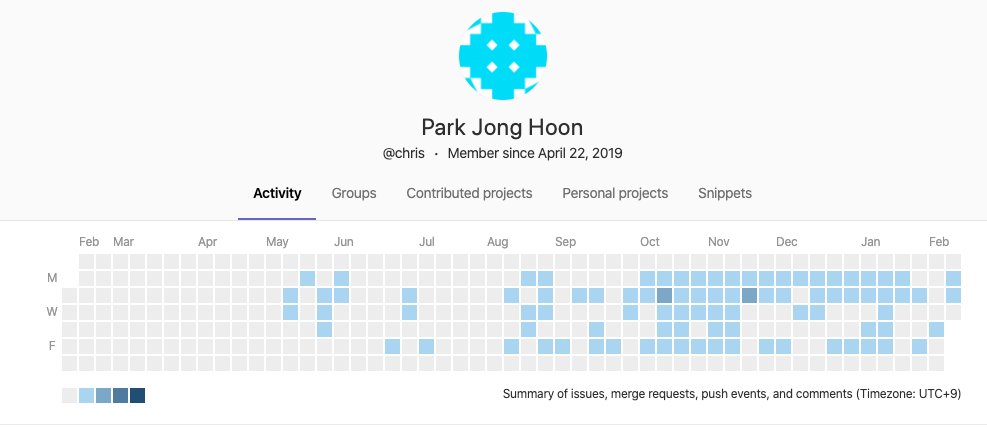

# 19-20년 성과정리

## 1. 19-20년 정량적 성과정리

1) 프로젝트 commit 

기간: 2019년 5월 14일 ~ 2020년 2월 11일 기준 
URL: http://125.131.88.146/chris 
총 누적 commit 수: 199번(merged, joined 제외한 순수 push횟수) 
=> 199번의 코드 작성 및 변경 작업을 진행함 
 

2) SBS 유통서비스전환 개발이슈(개발요건, 수정, 오류)에 대한 처리건수 
자료명: OPS_통합테스트케이스_유통서비스전환  
기간: 2019년 9월 17일 ~ 2019년 11월 21일 기준 
본인(박종훈) 등록된 이슈건: 79건 
개발자완료: 79건 
담당자 완료: 79건 
 

3) SBS 유통서비스전환 서비스 오픈 후 개발이슈(개발요건, 수정, 오류)에 대한 처리건수 
자료명: OPS 민원 접수 및 이슈 관리, 이슈관리 
기간: 2019년 10월 24일 ~ 2020년 01월 07일 기준 
본인(박종훈) 등록된 이슈건: 16건 
개발자 완료: 15건 
담당자 완료: 15건 
미완료 : 1건(오류가 갑자기 사라짐으로 인한 이슈추적 불가) 
 

4) SBS OPS_SLIM(스트리밍)고도화사업 이슈대장 
자료명: SBS OPS_SLIM(스트리밍)고도화사업_20200212) 
기간: 2020년 1월 ~ 진행중 
프로젝트 완료날짜: 4월 
진행된 이슈 / 전체 이슈: 7 / 11 
진척율: 63%  
 

## 2. 19-20년 정성적 성과결과

1) SBS 유통서비스전환 서비스 오픈 후 크리티컬한 이슈 없음
2) SBS OPS_SLIM(스트리밍)고도화사업 높은 진척율

## 3. 20년도 성과측정 방향설정 제시

1) 프로젝트 commit
2) Gitlap에 이슈등록 기능 활용하여 이슈처리율 활용
3) jira 애자일 활용